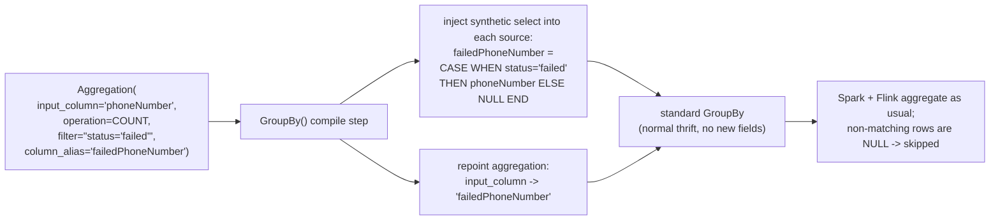
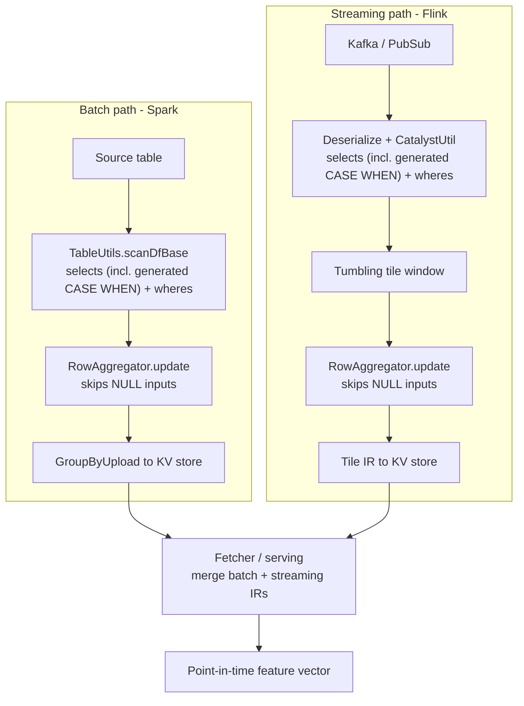

# GroupBy Aggregation-Level Filter Conditions — Design

> Status: Draft / Proposal
> Scope: Two conditional-logic ergonomics for `GroupBy`, both implemented as **Python compile-layer helpers** with **no thrift or Scala changes**: (1) a *simple, per-aggregation filter condition* (syntax sugar over `selects`); and (2) a fluent `when`/`else` builder for authoring `CASE WHEN` *value* expressions in `selects`. Both work consistently across the batch (Spark) and streaming (Flink) engines. A first-class engine representation of the filter is described as an optional follow-up.

## Table of Contents
1. [Background](#background)
2. [Goals and Non-Goals](#goals-and-non-goals)
3. [Benefits](#benefits)
4. [Design Overview](#design-overview)
5. [API Design](#api-design)
6. [Desugaring Rules](#desugaring-rules)
7. [The `when`/`else` selects builder](#the-whenelse-selects-builder)
8. [Architecture and Data Flow](#architecture-and-data-flow)
9. [Batch + Streaming Consistency](#batch--streaming-consistency)
10. [Impacts](#impacts)
11. [Edge Cases and Risks](#edge-cases-and-risks)
12. [Rollout Plan](#rollout-plan)
13. [Alternatives Considered](#alternatives-considered)
14. [Optional Follow-Up: First-Class Engine Representation](#optional-follow-up-first-class-engine-representation)
15. [Appendix: Worked Example](#appendix-worked-example)

---

## Background

Chronon's `GroupBy` aggregates raw rows into ML features (e.g. `SUM`, `COUNT`, `APPROX_UNIQUE_COUNT`) over time windows. Each `Aggregation` today exposes exactly five attributes (`thrift/api.thrift:238-264`): `inputColumn`, `operation`, `argMap`, `windows`, `buckets`. There is **no `filter` / `where` / `condition`** on `Aggregation`.

Filtering is only available at two places today:

- **Source-wide** via `Query.wheres` (`thrift/api.thrift:12`) — a SQL `WHERE` applied to the *whole* scan; every aggregation in the `GroupBy` is affected identically, and it can even drop rows (and therefore keys) that other aggregations still need.
- **Per-column** via `IF(...)` / `CASE WHEN` inside `Query.selects` — the current workaround.

### Current workaround and its limitation

To get a "filtered count" or "filtered unique count" today, users encode the predicate as a derived column in the **source** and then aggregate that derived column. From `_chronon_gcp_setup/sources/sign_up_pre_source.py`:

```python
selects={
    "requestId": "requestId",
    "deviceId": "deviceId",
    "phoneNumber": "phoneNumber",
    "intent": "intent",
    "createdAt": "createdAt",
    # filter encoded as derived columns:
    "smsPhoneNumber": "CASE WHEN intent = 'SMS' THEN phoneNumber ELSE NULL END",
    "intentIsSms":    "CASE WHEN intent = 'SMS' THEN 1 ELSE NULL END",
},
```

and in `_chronon_gcp_setup/group_bys/risk_signup_pre/tl_did.py`:

```python
aggregations=[
    Aggregation(input_column="smsPhoneNumber", operation=Operation.APPROX_UNIQUE_COUNT, windows=[Window(14, TimeUnit.DAYS)]),
    Aggregation(input_column="intentIsSms",    operation=Operation.COUNT,               windows=[Window(1,  TimeUnit.DAYS)]),
]
```

This works because Chronon aggregators already ignore `null` inputs (`DirectColumnAggregator.scala:50`). But it has real drawbacks:

- **Source pollution**: every filtered feature needs a bespoke derived column in the source, so the source `selects` grows with the number of feature/predicate combinations.
- **Leaky abstraction**: the filter intent lives in the *source*, far from the `Aggregation` that needs it, hurting readability and reuse.
- **`null`-trick fragility**: encoding a filter as "null-out the value" is non-obvious and easy to get subtly wrong.

### Key insight driving this design

The workaround already produces the correct result in **both** engines — because both Spark (`TableUtils.scanDfBase`, `:709`) and Flink (`CatalystUtil`, `:179`) evaluate `Query.selects` through the **same** Spark Catalyst engine, and both drive the **same** aggregator core (`RowAggregator`) that skips nulls. So the feature we want is not a new engine capability — it is the *ergonomics* of authoring that workaround. That means it can be delivered entirely as a **compile-time transformation in the Python layer**: generate the `CASE WHEN … ELSE NULL` column for the user, keep the authored config clean, and change nothing in thrift, Scala, Spark, or Flink.

---

## Goals and Non-Goals

### Goals
- Allow a **single, simple filter condition per `Aggregation`**, authored next to the aggregation.
- Deliver it as **Python compile-layer syntax sugar** — no thrift, Scala, or engine changes.
- Work identically in **batch (Spark)** and **streaming (Flink)** and merge correctly at **serving** time (inherited for free from the existing `selects`/aggregator path).
- Preserve **online/offline consistency** and **semantic-hash** correctness (inherited from the existing select-expression hashing).
- Give the author explicit control over the output feature name via `column_alias`.
- Be **backward compatible**: configs without a filter compile byte-for-byte as today.

### Non-Goals
- Engine/thrift changes in v1 (see [Optional Follow-Up](#optional-follow-up-first-class-engine-representation)).
- Arbitrary cross-row / cross-aggregation filters (e.g. "top N keys by volume").
- Replacing `Query.wheres` (source-wide filtering) or `buckets` (map-valued sub-grouping); this composes with both.
- Value-mapping / multi-branch `CASE WHEN` value construction **on the aggregation**. A filter is a **boolean row predicate**; producing a computed *value* belongs in `selects`. That need is served by the [`when`/`else` selects builder](#the-whenelse-selects-builder) (included in this work), which emits a `selects` expression rather than living on the aggregation.
- Renaming an **unfiltered** aggregation's output. `column_alias` is only meaningful together with `filter`; use `derivations` for pure renames.

---

## Benefits

- **Locality & readability**: the predicate lives on the `Aggregation`, not buried in source `selects`.
- **Clean authored sources**: the generated `CASE WHEN` columns exist only in the compiled output, not in the hand-written config.
- **Reuse**: one natural source column (`phoneNumber`, `amount`) can be aggregated under many predicates without hand-fabricating a derived column per combination.
- **Explicit, collision-free naming**: `column_alias` gives the author direct control of the output feature name.
- **Readable conditional values**: the companion [`when`/`else` builder](#the-whenelse-selects-builder) makes multi-branch `CASE WHEN` *value* expressions in `selects` far less error-prone than raw SQL strings, complementing the boolean `filter`.
- **Zero engine risk**: no thrift migration, no Scala changes, no change to the aggregation hot path, IR layout, tiling, or serving-merge. Consistency and semantic hashing are inherited from the existing, proven `selects` path.

---

## Design Overview

`filter` and `column_alias` are **authoring-only** parameters, carried on the `Aggregation` object (the same way `tags` already is — `group_by.py:307`) and **consumed by the `GroupBy` compile step**. They are never serialized as thrift fields.

At compile time, for each aggregation that has a `filter`, the compiler:
1. Generates a synthetic select column `<column_alias> = CASE WHEN (<filter>) THEN <input_column> ELSE NULL END`.
2. Injects it into **every** source's `query.selects` (deduplicated).
3. Repoints the aggregation's `input_column` to `<column_alias>`.

The result is an ordinary `GroupBy` on ordinary columns — indistinguishable from the hand-written workaround, so every downstream stage (semantic hashing, thrift emission, Spark, Flink, serving) is unchanged.



---

## API Design

### Python

```python
Aggregation(
    input_column="phoneNumber",
    operation=Operation.COUNT,
    windows=[Window(1, TimeUnit.DAYS)],
    filter="status = 'failed'",        # single boolean SQL expression
    column_alias="failedPhoneNumber",  # required when filter is set; names the output prefix
)
# -> output feature: failedPhoneNumber_count_1d
```

- **`filter`** — a single SQL boolean expression over the source query's columns. Use `AND` / `OR` / parentheses for compound conditions (`status = 'failed' AND amount > 100`). `filter=None` ⇒ unchanged behavior.
- **`column_alias`** — the output-name prefix (replacing `input_column`); the feature becomes `<column_alias>_<op>_<window>`. **Required whenever `filter` is set** (see [Desugaring Rules](#desugaring-rules)).

No thrift change: `Aggregation()` attaches `filter` / `column_alias` as attributes on the returned object (as it already does for `tags`, `group_by.py:307`); `GroupBy()` consumes them during compilation.

> `filter` shadows the Python builtin only inside the `Aggregation(...)` keyword scope and is otherwise harmless.

---

## Desugaring Rules

The transformation runs as an early `GroupBy` compile pass — a natural extension of `_sanitize_columns` (`group_by.py:692-707`), which already injects required columns into `query.selects`. It runs during source normalization (`group_by.py:717`), **before** semantic hashing, thrift emission, and output-schema derivation, so all downstream logic sees a standard `GroupBy`.

### 1. Value construction (uniform across operations)

Every filtered aggregation is rewritten to:

```sql
<column_alias> = CASE WHEN (<filter>) THEN <input_column> ELSE NULL END
```

and the aggregation's `input_column` is repointed to `<column_alias>`. Because aggregators skip null inputs (`DirectColumnAggregator.scala:50`), non-matching rows contribute nothing — for **all** operations (`SUM`, `AVERAGE`, `MIN`/`MAX`, `APPROX_UNIQUE_COUNT`, percentiles, `LAST_K`, etc.).

### 2. COUNT convention

`COUNT` counts non-null inputs, so a filtered `COUNT` counts rows where `(<filter> is true) AND (<input_column> is not null)`. To count **all** matching rows regardless of input nullness, point `COUNT` at a guaranteed-non-null column (e.g. a key/id such as `requestId`). This matches the existing workaround, where users `COUNT` a `CASE WHEN cond THEN 1 ELSE NULL END`-style column. No operation-specific desugaring is applied — the uniform rule above is the single mental model.

### 3. `column_alias` required when `filter` is set

The output feature name derives from the (now synthetic) input-column name. Requiring an explicit `column_alias` avoids leaking a generated/opaque name into the feature and forces the author to choose a clear, stable name. Validation:
- `filter` set **without** `column_alias` ⇒ compile error.
- `column_alias` set **without** `filter` ⇒ compile error (out of scope; use `derivations` to rename).

### 4. Collision checks

Compile-time validation (in `_desugar_agg_filters` / `_sanitize_columns`) must reject:
1. **Alias vs. reserved names** — `<column_alias>` must not equal a **GroupBy key**, the reserved **`ts`** time keyword, or any aggregation's **`input_column`**. These are materialized as identity `selects` during normalization — *including when `Query(selects=None)`* — so overwriting one with the CASE would silently change the grouping key, corrupt time-column handling, or clobber another aggregation's input. Checked in `_desugar_agg_filters` (which knows `keys` + all aggregation inputs) **before** any identity select is written.
2. **Alias vs. authored selects** — `<column_alias>` must not already be a key in any source's user-provided `selects` (otherwise the synthetic column would shadow a real one).
3. **Duplicate output features** — compute every resolved output name (`<alias-or-input>_<op>_<window>[_by_bucket]`) across *all* aggregations (filtered and unfiltered) and reject duplicates, e.g.:
   > Aggregations produce duplicate output column `phoneNumber_count_1d`. Set a distinct `column_alias`.
4. **Conflicting synthetic definitions** — if two aggregations use the same `column_alias`, they must resolve to a **byte-identical** generated expression (exact-string equality of the whole `CASE WHEN … END`); identical definitions are deduplicated (injected once), any difference errors. Different aliases never dedup.

### 5. Semantic hashing (no code change needed)

Because the generated `CASE WHEN` becomes the aggregation's input-column select expression, it is automatically folded into the column's semantic hash by the existing logic (`column_hashing.py:184-192`, via `get_input_expression_across_sources`). Editing a `filter` changes the expression ⇒ changes the hash ⇒ correctly detected as a semantic change. Renaming via `column_alias` changes the output column name (the hash's key) ⇒ handled as a normal rename.

### 6. Predicate canonicalization (verbatim — no normalization)

The `filter` is embedded **verbatim** — the exact authored string, with **no** whitespace, quoting, or AST normalization — into `CASE WHEN (<filter>) THEN <input_column> ELSE NULL END`. This is intentional and identical to how Chronon carries and hashes every other `selects` / `wheres` expression today (all are raw text). The exact canonical form is therefore "the authored predicate string, unchanged". Concretely:

- **Dedup** is exact-string equality of the *generated expression*, scoped to a shared `column_alias` (§4.3): same alias ⇒ must be byte-identical; different aliases never dedup.
- **Naming** uses the user-chosen `column_alias` (`<column_alias>_<op>_<window>`) — **never** a hash of the predicate — so predicate formatting can never change a feature name.
- **Semantic hash**: the generated expression is folded verbatim into the per-column hash (§5). Reformatting the predicate (spaces, quotes, parentheses) changes the hash, exactly as reformatting any other select expression does. (E.g. `status='paid'`, `status = 'paid'`, and `(status = 'paid')` are three distinct hashes.)

Formatting-insensitive canonicalization is **out of scope for v1**, deliberately: (1) it would make `filter` behave differently from every other expression field; and (2) a formatting-level canonicalizer (e.g. `sqlglot` parse → re-serialize) normalizes whitespace/quoting but **not** semantic equivalence (`a AND b` vs `b AND a`, constant folding, identifier casing), so it would still not guarantee "equivalent filters hash identically". If we want it, the right scope is a separate, **system-wide** change that canonicalizes all `selects`/`wheres` before hashing — not a filter-only special case.

### 7. Multi-source and column scope

The synthetic column is injected into **every** source of the `GroupBy` (all sources must expose the same columns). The `filter` is evaluated in the projection step, so it may reference the source's columns/expressions but **not** sibling `selects` aliases (standard SQL `SELECT`-list scoping). Validation should surface a clear error if a predicate references an unavailable column.

---

## The `when`/`else` selects builder

Filters cover *row selection*; the `when`/`else` builder covers *value construction* — the other half of conditional logic in a `GroupBy`. It is a small, pure-Python fluent helper that renders a SQL `CASE WHEN … END` string, so it drops directly into a source's `selects`. It adds **no** new engine concept — it only makes authoring `CASE WHEN` value expressions less error-prone than hand-written SQL.

### API

```python
from ai.chronon.types import when   # also: from ai.chronon.query import when

when("region = 'US'", "amount * 1.1") \
    .when("region = 'EU'", "amount * 1.2") \
    .else_("amount")
# renders: "CASE WHEN region = 'US' THEN amount * 1.1 WHEN region = 'EU' THEN amount * 1.2 ELSE amount END"
```

- `when(condition, value)` starts the expression; chain `.when(...)` for additional branches.
- `.else_(default)` (alias `.otherwise(default)`) sets the fallback. `else` is a reserved keyword in Python, hence the trailing underscore.
- Omitting `.else_(...)` leaves the default as SQL `NULL` (renders `CASE WHEN … END`).
- `condition` and `value` are **raw SQL expressions** (like any `selects` value): a Python `None` renders as `NULL`, numbers render as literals, and string *literals* must be quoted by the caller (`"'SMS'"`).

The builder is a `str` subclass whose value is the rendered SQL, so it works anywhere a select-expression string is expected — no special handling in `Query`, thrift serialization, or hashing:

```python
Query(selects={
    "adjusted_amount": when("region = 'US'", "amount * 1.1").else_("amount"),
    "sms_phone":       when("intent = 'SMS'", "phoneNumber").else_(None),
})
```

### Relationship to `filter`

| | `filter` (on `Aggregation`) | `when`/`else` (in `selects`) |
|---|---|---|
| Produces | a **boolean** row predicate | a **value** expression |
| Answers | *which rows* count | *what value* to compute |
| Lives on | the aggregation | the source `selects` |

`filter="intent = 'SMS'"` is exactly `when("intent = 'SMS'", input_column).else_(None)` fed to the same aggregation — which is why filtering is modeled as a boolean on the aggregation while general value-mapping stays in `selects`.

---

## Architecture and Data Flow

Because the feature desugars to a normal aggregation on a normal column, the runtime data flow is **identical to any other GroupBy** — nothing engine-side is filter-aware.



The generated `CASE WHEN` column is evaluated by the same Catalyst engine in both paths (Spark `selectExpr`, `TableUtils.scala:709`; Flink `CatalystUtil.selectExpr`, `CatalystUtil.scala:179`), and both feed the same null-skipping `RowAggregator`.

---

## Batch + Streaming Consistency

This reduces to the consistency of the existing `selects` + aggregator path, which is already relied upon in production:

- **Same predicate evaluation.** The generated `CASE WHEN` is projected identically in Spark and Flink (same Catalyst engine).
- **Same aggregation.** Both engines run the same `RowAggregator`; non-matching rows are `NULL` and skipped identically (`DirectColumnAggregator.scala:50`, including the mutation `delete` path at `:63`).
- **No new IR / merge surface.** The aggregation is ordinary, so IR layout, tiling (`TileCodec`), and serving-merge are unchanged. There is no filter-specific ordering or expansion to keep in sync.
- **Same hashing.** Online/offline consistency and schema-evolution checks operate on the (filter-inclusive) select expression via the existing per-column hash.

In short: if the hand-written `CASE WHEN` workaround is consistent today (it is), the generated form is consistent by construction.

---

## Impacts

| Area | Impact |
| --- | --- |
| **Backward compatibility** | Fully compatible; `filter=None` compiles exactly as today. |
| **Engine code (Scala/Spark/Flink)** | None. |
| **Thrift** | None. |
| **Online/offline consistency** | Preserved (inherited from the `selects` + aggregator path). |
| **Serving merge / IR / tiling** | Unchanged; no new IR slots. |
| **Performance** | Equivalent to hand-writing the `CASE WHEN` today; one generated boolean-gated column per distinct filtered aggregation. |
| **Compiled artifact** | `selects` in the compiled config contains compiler-generated `CASE WHEN` columns (the "messiness" moves from authored source to generated output). |
| **Metadata / lineage** | The filter is desugared away, so it is not a first-class field in the compiled model (see [Optional Follow-Up](#optional-follow-up-first-class-engine-representation)). |

---

## Edge Cases and Risks

1. **COUNT + nullable input** — filtered `COUNT` counts rows where the predicate holds *and* the input column is non-null; use a non-null column for a pure matching-row count (see [Desugaring Rules §2](#desugaring-rules)).
2. **Filter references a derived `selects` alias** — not supported in v1 (SQL `SELECT`-list scoping); the predicate must reference source columns/expressions. Validation should error clearly.
3. **Multi-source GroupBys** — the predicate must be valid against every source; the synthetic column is injected into each.
4. **Name collisions** — handled by the collision checks (aliases vs. existing selects, duplicate output features, conflicting synthetic definitions).
5. **Composition with `buckets` / `wheres`** — unaffected: bucket/where columns remain in `selects`; the gate is just a `NULL`ed input value.
6. **Compiled-config readability** — the generated `CASE WHEN` columns are visible in compiled `selects`; use a clear naming scheme (e.g. the `column_alias`) so they are self-explanatory when debugging Spark/Flink SQL.

---

## Rollout Plan

A single, Python-only change — no phased engine rollout required.

**Milestone 1 — feature.** Add `filter` / `column_alias` params to `Aggregation()`; implement the compile-time desugaring in the `GroupBy` build (alongside `_sanitize_columns`, `group_by.py:692`); add validation (alias-required, collision checks, predicate column validation). Tests: compiler unit tests (desugaring, dedup, collision, alias-required, hashing); a compile-golden test confirming the generated `selects` matches the hand-written workaround; and a Spark/Flink parity test on a filtered `GroupBy` (guarding the inherited consistency).

**Milestone 2 — docs & migration.** Update `docs/source/authoring_features/GroupBy.md`; provide a migration note for existing `CASE WHEN`-based features and guidance on choosing `column_alias`.

---

## Alternatives Considered

- **Keep the `CASE WHEN` workaround** — zero code, but perpetuates source pollution and fragile null-trick semantics (the motivation for this doc).
- **Filter only at the `Query` level (`wheres`)** — source-wide; cannot express different predicates per aggregation and can drop keys other aggregations need.
- **Model filters via `buckets`** — buckets produce a map keyed by a column's values, not a yes/no gate; semantically wrong and inflates output into maps.
- **Post-aggregation `derivations`** — run after aggregation; cannot change *which rows* feed an aggregate.
- **A multi-branch value builder on the *aggregation*** — rejected: a multi-branch `CASE WHEN` constructs a *value*, not a boolean predicate. The same capability is provided as a `selects` builder instead (see [The `when`/`else` selects builder](#the-whenelse-selects-builder)), which keeps `filter` cleanly boolean and the value reusable across aggregations and derivations.
- **First-class thrift/Scala `filter` field** — deferred; see below. Functionally identical to the sugar; buys representation, not capability.

---

## Optional Follow-Up: First-Class Engine Representation

If we later want the filter to be a **first-class field** in the compiled model (e.g. for a feature catalog, lineage, or config introspection) rather than desugared into an opaque `CASE WHEN`, we can add it to the engine directly. This is **functionally identical** to the sugar — it produces the same results — so it is a representation/tooling improvement, not a new capability, and is not required for v1.

Sketch (only if/when justified):
- **Thrift**: add `Aggregation.filter` + `Aggregation.columnAlias` (fields 6, 7) and the same on `AggregationPart`; regenerate bindings.
- **Expansion**: pass the scalars through `unpack` / `unWindowed` / `UnpackedAggregations.from` (`Extensions.scala:284-380`) — no ordering change, since the filter is a scalar, not a cross-product dimension (`TileCodec.expanderMappings` is unaffected).
- **Aggregator gate**: resolve the (compiler-injected) boolean column to an index in `RowAggregator` exactly as `bucket` is (`RowAggregator.scala:47-53`), and gate `update`/`delete` in **all three** concrete aggregators — `DirectColumnAggregator`, `BucketedColumnAggregator`, and `MapColumnAggregator`.
- **Naming**: `outputColumnName` uses `columnAlias ?? inputColumn` in **both** Scala (`Extensions.scala:276`) and Python (`get_output_col_names`), guarded by a naming-parity test.
- **Hashing**: add the predicate to the per-output-column hash in the aggregation loop (`column_hashing.py:184-192`), not to base semantics.

Costs vs. the sugar: a thrift migration, Scala aggregator changes, and the Scala↔Python naming-parity + hashing considerations — for a purely representational benefit. Recommended only if a concrete consumer needs the filter as a real field.

---

## Appendix: Worked Example

Re-expressing `_chronon_gcp_setup/group_bys/risk_signup_pre/tl_did.py`.

### Authored config (after)

```python
v2 = GroupBy(
    version=2,
    sources=[main_source],           # source no longer needs smsPhoneNumber / intentIsSms
    keys=["deviceId"],
    aggregations=[
        Aggregation(
            input_column="phoneNumber",
            operation=Operation.APPROX_UNIQUE_COUNT,
            windows=[Window(14, TimeUnit.DAYS)],
            filter="intent = 'SMS'",
            column_alias="smsPhoneNumber",   # -> smsPhoneNumber_approx_unique_count_14d
        ),
        Aggregation(
            input_column="requestId",        # non-null key -> filtered COUNT == count of matching rows
            operation=Operation.COUNT,
            windows=[Window(1, TimeUnit.DAYS)],
            filter="intent = 'SMS'",
            column_alias="smsRequest",        # -> smsRequest_count_1d
        ),
    ],
    accuracy=Accuracy.TEMPORAL,
    online=True,
)
```

### What the compiler generates (equivalent to today's hand-written workaround)

```python
# injected into each source's query.selects:
"smsPhoneNumber": "CASE WHEN intent = 'SMS' THEN phoneNumber ELSE NULL END",
"smsRequest":     "CASE WHEN intent = 'SMS' THEN requestId ELSE NULL END",

# aggregations repointed:
Aggregation(input_column="smsPhoneNumber", operation=APPROX_UNIQUE_COUNT, windows=[Window(14, DAYS)])
Aggregation(input_column="smsRequest",     operation=COUNT,               windows=[Window(1,  DAYS)])
```

### Collision example — same column, two filters

```python
aggregations=[
    # Both would otherwise emit phoneNumber_count_1d; column_alias disambiguates.
    Aggregation(
        input_column="phoneNumber", operation=Operation.COUNT, windows=[Window(1, TimeUnit.DAYS)],
        filter="status = 'failed'",  column_alias="failedPhoneNumber",   # -> failedPhoneNumber_count_1d
    ),
    Aggregation(
        input_column="phoneNumber", operation=Operation.COUNT, windows=[Window(1, TimeUnit.DAYS)],
        filter="status = 'success'", column_alias="successPhoneNumber",  # -> successPhoneNumber_count_1d
    ),
]
```

The filter intent lives next to each aggregation, the authored source stays clean, and output names are explicit and collision-free — all computed identically in Spark and Flink and merged correctly at serving, with no engine or thrift changes.
