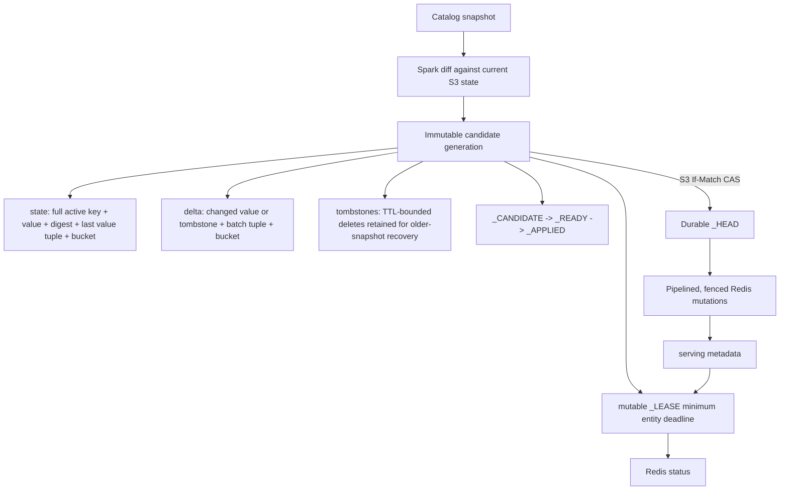

# Redis and Valkey KVStore

This module provides Chronon's Redis Cluster KVStore and its incremental Spark batch upload path. The Redis module is
bundled into `cloud_aws`; no extra KVStore JAR or factory implementation setting is required.

## AWS Selection

DynamoDB remains the AWS default. Select Redis in each runtime with:

```text
KV_STORE_TYPE=redis
```

The catalog-backed upload step is selected independently in team/common configuration with:

```text
spark.chronon.table_write.upload.format=catalog
```

`group-by-upload` reads `spark.chronon.table_write.upload.format`; set it to `catalog` for the catalog-backed Redis
upload table instead of DynamoDB's Ion import files. Commands that cannot set the runtime environment can pass
`-ZKV_STORE_TYPE=redis` directly to the online API.

AWS Redis batch uploads default to `incremental`. Existing full-snapshot upload jobs must set
`spark.chronon.kv_upload.redis.mode=full_snapshot` before upgrading. Supply this upload-only property through team/common
configuration, Spark configuration, or `-Z`. Fetchers do not receive or need it; Redis reads determine the publication
protocol from the stored dataset metadata.

Do not switch a live key prefix between upload protocols in place. A migration to incremental uploads needs a new Redis
key prefix and fresh `state_root`; complete the first upload in that namespace before moving fetcher traffic to it. A
key-prefix cutover still requires the normal serving deployment change, but no fetcher batch-mode setting.

The Redis publisher disables Spark speculation in the session it creates; if it is given an existing Spark context
with speculation enabled, it fails rather than running duplicate mutation attempts.

`spark.chronon.table_write.format` selects the deployment's normal catalog format. The AWS scaffold selects Iceberg as
that format, and Iceberg supports the binary `key_bytes` and `value_bytes` columns used by Redis. The scaffold does not
configure Glue or another catalog; the deployment must supply the Spark catalog configuration used by its upload table.

The job role can authorize S3 and catalog access. Redis authentication is separate and uses the connection settings
below. The client supports private/unauthenticated Redis or static ACL username/password with optional TLS; it does not
generate or refresh AWS IAM authentication tokens.

## Configuration

Connection settings retain their existing environment aliases for secrets and runtime deployment configuration.

| Environment variable | Configuration key | Default |
| --- | --- | --- |
| `REDIS_CLUSTER_NODES` | `redis.cluster.nodes` | required |
| `REDIS_USERNAME` | `redis.username` | unset |
| `REDIS_PASSWORD` | `redis.password` | unset |
| `REDIS_USE_SSL` | `redis.ssl` | `false` |
| `REDIS_KEY_PREFIX` | `redis.key.prefix` | `chronon` |
| `REDIS_MAX_CONNECTIONS` | `redis.max.connections` | `50` |
| `REDIS_MIN_IDLE_CONNECTIONS` | `redis.min.idle.connections` | `5` |
| `REDIS_MAX_IDLE_CONNECTIONS` | `redis.max.idle.connections` | `10` |
| `REDIS_CONNECTION_TIMEOUT_MS` | `redis.connection.timeout.ms` | `5000` |
| `REDIS_SO_TIMEOUT_MS` | `redis.so.timeout.ms` | `2000` |
| `REDIS_MAX_REDIRECTIONS` | `redis.max.redirections` | `5` |

Environment variables take precedence over submitted properties. Prefer environment variables for credentials. Bulk
writers use a small internal pool and do not validate a connection on every borrow/return.

There are distinct configuration paths:

- A planner-backed scheduled publication has `group-by-upload` followed by `upload-to-kv`. The first step reads
  `spark.chronon.table_write.upload.format=catalog` from the compiled GroupBy configuration. The existing KV upload node
  runner merges its effective common configuration into the online API properties, so
  `spark.chronon.kv_upload.redis.mode` and `redis.*` client configuration reach the upload without extra submitter
  plumbing. `KV_STORE_TYPE=redis` selects the runtime backend.
- The legacy `Driver` `upload-to-kv` path has no planner node metadata. Give it selector/client settings through
  `KV_STORE_TYPE`/`REDIS_*`, or pass the corresponding `-Z` arguments directly on that command. Pass the upload mode as
  `-Zspark.chronon.kv_upload.redis.mode=...`. CLI `-Z` properties take precedence over node common values when the node
  runner is used. `CHRONON_ONLINE_ARGS` remains scoped to online run modes.
- The `spark.chronon.kv_upload.redis.*` operator settings may come from team common Spark configuration or `-Z`.
  Team common values are already folded into compiled mode configurations, and the Redis publisher reads the effective
  Spark configuration together with its API properties.
- The fetcher is a separate runtime and does not inherit Spark submission configuration. Configure it with
  `KV_STORE_TYPE=redis` plus the available `REDIS_*` environment variables, or pass `-ZKV_STORE_TYPE=redis` and the
  corresponding `-Zredis.*` properties to `FetcherMain`. Batch upload mode is not a fetcher setting.

Incremental batch upload settings can be supplied through team common configuration, as Spark properties, or as
matching `-Z` properties. The node runner resolves them in that order, with `-Z` taking precedence. Full-snapshot mode
does not use these settings; it performs all-row SETEX writes with the existing five-day TTL and no durable status,
tombstones, or deletion of omitted keys.

| Property | Default | Meaning |
| --- | ---: | --- |
| `spark.chronon.kv_upload.redis.mode` | `incremental` on AWS | Batch upload protocol: `incremental` or `full_snapshot` |
| `spark.chronon.kv_upload.redis.state_root` | required in incremental mode | Durable S3 root for Redis publication state |
| `spark.chronon.kv_upload.redis.max_keys_per_second` | `2500000` | Cluster-wide attempted key-command ceiling |
| `spark.chronon.kv_upload.redis.writer_partitions` | `2` | Concurrent Spark writer partitions |
| `spark.chronon.kv_upload.redis.ttl_seconds` | `432000` | Renewable value, metadata, and status lease |
| `spark.chronon.kv_upload.redis.delete_older_versions` | `false` | After publishing a numeric `__N` GroupBy version, retire lower versions found under the same S3 state root |

`CHRONON_METADATA` config records are written through the direct KV path without expiry. They are not governed by the
batch lease above and remain available until explicitly replaced or deleted.

A state root is the durable identity of one Redis serving target and must not be shared across Redis clusters. A dataset
lineage must keep the same key prefix. The first admitted generation fixes the internal state sharding for that lineage.
A TTL change publishes a new generation; a refresh of an existing generation uses the TTL recorded with that generation.
TTL may increase or decrease in place, and each new generation uses its configured TTL for both live values and new
delete fences. Concurrent jobs sharing a cluster must use the same rate while the shared queue is active.

Older-version retirement is opt-in. The new version's source snapshot, state, delta, and `_READY` record must first be
validated and durably admitted as the S3 head; lower versions are then retired before the new Redis mutations begin so
their memory is available to the replacement upload. This capacity-first cutover can leave the feature unavailable if
the replacement apply is interrupted, but the admitted immutable generation is replayed by the next invocation. For a
fresh version, invalid or empty replacement snapshots fail before retirement. The loader recognizes GroupBy names
ending in `__<number>`, discovers lower versions from the durable state root, and CAS-admits an immutable retired child
generation in each old lineage. That child first publishes a small persistent retired status and then physically removes
the old active keys,
retained tombstones, and serving metadata with Redis `UNLINK`. `UNLINK` makes each key immediately absent while reclaiming
its value memory asynchronously off the Redis command thread. The bounded retirement status and rate-limiter scripts
remain executable above `maxmemory`, so cleanup can reach `UNLINK`; replacement writes retain their OOM retry while
asynchronous reclamation catches up. A missing state root or an old lineage without a `_HEAD` is a no-op; a headed but
corrupt lineage fails cleanup so leaked live keys are not silently ignored. Retired heads written by the earlier
tombstone-based protocol are migrated once to a zero-tombstone physical delete generation. The immutable S3 delete set
makes an interrupted cleanup replayable and a Redis restore recoverable.

## Publication Protocol

Each source partition is a complete snapshot with at least one entity row, unique `key_bytes`, non-null `value_bytes`,
and exactly one `GroupByServingInfo` row. The loader checks these invariants before admitting a generation.



The S3 layout is:

```text
<state_root>/<source_table>/<batch_dataset>/
  _HEAD
  claims/<uuid>
  generations/<uuid>/
    _CANDIDATE
    state/redis_bucket=<n>/part-*.parquet
    delta/redis_bucket=<n>/part-*.parquet
    tombstones/redis_bucket=<n>/part-*.parquet
    _READY
    _APPLIED
    _LEASE
```

`_HEAD` is the durable publication pointer. It contains a monotonic revision, the admitted generation, its parent, and
the `_READY` digest. AWS updates it with an S3 ETag conditional write. A generation may be the head before `_APPLIED`
exists; the next invocation completes that immutable generation before admitting another one. Losing Redis status does
not lose the durable pointer or recovery values.

The first publication must use a fresh Redis key prefix or an otherwise empty serving namespace. With no prior S3
state, the loader cannot discover and tombstone unknown legacy keys that are absent from the source snapshot.

`_CANDIDATE`, `_READY`, `_APPLIED`, `_LEASE`, `_HEAD`, and `claims/<uuid>` are binary protocol records. `_LEASE` is a
small monotonic checkpoint containing the earliest guaranteed expiry among active entity keys. The other generation
records remain unchanged and immutable. Candidate claims fence cleanup against active admission; an expired unclaimed
candidate is marked abandoned before deletion, so a late writer must rebuild under a new UUID.

Cleanup re-reads `_HEAD` before deletion. It keeps the current generation and any state generation it references, gives
the previous head a reader grace period, and removes expired failed or losing candidates. On a versioned S3 bucket,
configure lifecycle expiry for noncurrent versions under the state root because deleting obsolete generation paths
otherwise leaves noncurrent object versions billable.

Cleanup runs after successful uploads and deliberately keeps the current durable snapshot. To decommission a dataset,
stop its upload schedule, wait at least its Redis TTL plus recovery margin, verify that no reader or upload still uses the
lineage, then remove its `<state_root>/<source_table>/<batch_dataset>` subtree. Redis key expiry does not remove that S3
subtree.

## Ordering and Recovery

Every Redis value and tombstone carries `(source timestamp, write epoch)`. Timestamp is compared first, so an older
partition cannot overwrite a later partition. Equal timestamps use the S3 lineage epoch, making corrected same-partition
uploads deterministic. Older jobs repair and renew the current head instead of moving it backward.

On servers that support `CLIENT NO-TOUCH`, each publication checks the absolute expiration of every unchanged active key
against the parent generation's `_LEASE` deadline. The Lua command uses `PEXPIRETIME` and, when needed, `PEXPIREAT`; it
does not read the value payload when the deadline matches. An anomalously later deadline validates the 22-byte ordering
header before accepting it, covering a concurrent older writer without making header reads the normal path. Dedicated
bulk-writer connections enable `CLIENT NO-TOUCH` on every checkout so those commands do not update eviction recency. A
missing key, persistent key, older expiration, or mismatched ordering tuple triggers a full replay from the immutable
value-bearing S3 state. Retained tombstones remove keys resurrected by an older Redis snapshot. A newer value is only
accepted as supersession when S3 proves that a strictly newer head exists.

Serving metadata is written after entity mutations. The generation's `_LEASE` checkpoint is advanced only after its
active-key guarantee is established, the Redis status mirror is written only after mutation validation, and `_APPLIED`
is written last. Managed fetchers require status, hide tombstones, and treat a value whose tuple is ahead of the
published status as unavailable. This prevents a half-written generation from being decoded with metadata that has not
been published yet.

Direct writes to stable entity keys do not provide an atomic whole-GroupBy cutover. During an upload, different keys can
temporarily reflect different applied generations. Retries are idempotent, interrupted generations are resumed, and S3
admission retry is iterative and bounded rather than recursive.

## Redis Value Format

The first eight timestamp bytes preserve compatibility with the original Redis batch encoding. The incremental path
adds 14 bytes for its magic/version, operation, and write epoch. TTL is Redis key metadata, not part of the stored value.

```text
Redis value bytes
+-------------------+----------------+---------+-----------+-------------+
| source timestamp  | magic/version  | op code | S3 epoch  | user value  |
| 8 bytes           | CRB2 / v1      | 1 byte  | 8 bytes   | payload     |
+-------------------+----------------+---------+-----------+-------------+

UPSERT: payload is the encoded Chronon value
DELETE: payload is empty and the value is a tombstone
```

## TTL and Removal

Changed values are written with the configured lease. Each newly admitted generation validates unchanged active keys
against the parent deadline and advances them when the new deadline is later; a TTL decrease never shortens an existing
key in place. An exact rerun checks the expiry fence but only advances it once half the configured lease has elapsed.
GroupBy serving metadata and the active status mirror receive a lease that expires no later than the earliest entity lease. The
batch default is five days, so a missed daily upload still leaves roughly four days after the last successful publication.

The deadline recorded in one generation's `_LEASE` never decreases. A child generation may start with a shorter lease,
while its unchanged keys retain any later parent expiration until the configured lease catches up. Restoring an older
Redis snapshot therefore restores expiration metadata that the next publication can validate before advancing.

Generations created by older loaders have no `_LEASE` checkpoint. The first new-loader publication that depends on one
uses the existing 22-byte ordering-header validation once, then creates the checkpoint. Servers without `CLIENT
NO-TOUCH` continue using that legacy validation path. The loader reads existing `_READY` version 4 records and writes
version 5 records containing the separate delete-fence TTL. `_APPLIED`, `_LEASE`, and Redis value bytes retain their
existing wire versions. Older loaders reject version 5 `_READY` records rather than losing the transition fence.

Removed entity keys become tombstones for the generation's configured TTL. Existing values and tombstones keep the
absolute expiration they already received, while new mutations use the shorter TTL after a decrease. Consequently, an
older Redis snapshot restored after the shorter delete fence expires can temporarily expose a stale deleted value until
its original value lease expires. If uploads for a GroupBy stop, its values, metadata, and active status age out. Marking
a GroupBy `online=false` does not itself stop uploads because offline GroupBys can still be join inputs; the scheduler
determines whether publication continues.

A GroupBy upload must contain at least one entity row; a zero-row computation fails before publishing so a missing
source partition cannot become a delete-all. Ordinary snapshots tombstone keys absent from the new state. To retire an
entire dataset, stop its upload schedule and let the Redis lease expire.

The TTL must exceed the maximum gap between successful uploads plus recovery time. Once an admitted generation starts
Redis application, that apply/retry phase aborts rather than running past its lease deadline. Redis must use
`maxmemory-policy=noeviction`; otherwise Redis can silently evict an earlier successful mutation while a later one is
still applying. The uploader verifies this through `INFO memory`, so its ACL must allow `INFO`.

With `noeviction`, Redis rejects writes when `maxmemory` is reached. The current failed batch (or final status write) is
retried with exponential backoff capped at 30 seconds, logging each wait so external scaling or memory release has time
to complete. Spark retries of one writer stage share a one-hour deadline rather than starting a new window per attempt.

## Throughput Limits

The rate is measured in attempted Redis key commands, not source records or pipeline requests:

- one changed key is one fenced Lua mutation;
- one removed key is one fenced Lua tombstone;
- one unchanged key is one expiration-fence command per newly admitted generation;
- one retained, unexpired tombstone is replayed once per upload;
- serving metadata is one final fenced mutation;
- commands are grouped into internal 1000-command pipeline flushes;
- all incremental batch-upload jobs share one cluster-wide rate queue.

The default rate is 2.5 million attempted key commands per second. The limiter is a long-term token bucket, not a strict
rolling-window ceiling: after an idle period it permits one internal pipeline batch immediately. It does not count normal
serving/streaming `multiPut` traffic or its own control commands. A different rate is accepted when the shared queue is
idle; concurrent jobs with mismatched rates fail clearly instead of silently creating independent limits or ratcheting
the cluster to the lowest value.

Value payload traffic is incremental. Every successful upload still scans the complete source and durable state, issues
one metadata-only expiration command for each unchanged entity key, and writes one complete immutable active-state
snapshot plus unexpired tombstones before obsolete generations are cleaned.
Spark scans, joins, shuffles, S3 Parquet writes, Redis CPU, tiered-value latency, retries, and replication determine the
achieved rate.

## Valkey 9 and Tiered Storage

Valkey 9 does not change the value protocol. The path uses RESP-compatible Jedis operations, pipelined `EVALSHA`, Lua
script reload, expiration metadata, and Redis Cluster hash slots. Tiered storage also needs no alternate value format.
The loader probes `CLIENT NO-TOUCH` support and enables it on every physical connection borrowed by its dedicated bulk
client. Probe connections are restored to normal mode, and serving/control clients are not changed. Once a generation
has `_LEASE`, normal unchanged-key validation reads only expiration metadata; a later-than-checkpoint expiration reads
the ordering header, and an exact mutation replay reads the full value to verify byte equality.

Keys and Redis metadata still consume memory even when values are placed on SSD. Expiration checks and renewals do not
load unchanged payloads or refresh their eviction recency, allowing tiered values to remain cold. They still consume
Redis command, replication, and expiration-metadata write capacity. Run with `noeviction`, leave memory headroom, and
canary the configured rate while monitoring per-node CPU, command latency, replication lag, OOM errors, connections, and
memory/SSD item counts.

The protocol repairs missing or rolled-back keys on a forced status recovery or the next publication, but it cannot make
an acknowledged Redis shard write survive a cluster failover. If the status slot survives while a data slot rolls back,
reads can return an older value or a miss until that repair runs. Configure Redis/Valkey replication durability for the
serving requirement and treat S3 as the upload recovery source.

## Tests

Use the repository's Mill targets directly:

```bash
./mill --no-server redis.test
./mill --no-server redis.test.testOnly ai.chronon.integrations.redis.RedisKVStoreTest
./mill --no-server redis.test.testOnly ai.chronon.integrations.redis.Valkey9CompatibilityTest
```

Testcontainers uses the caller's Docker environment. For Colima, configure the shell rather than relying on repository
scripts to discover a machine-specific socket:

```bash
DOCKER_HOST="unix://$HOME/.colima/default/docker.sock" \
TESTCONTAINERS_DOCKER_SOCKET_OVERRIDE=/var/run/docker.sock \
./mill --no-server redis.test
```
